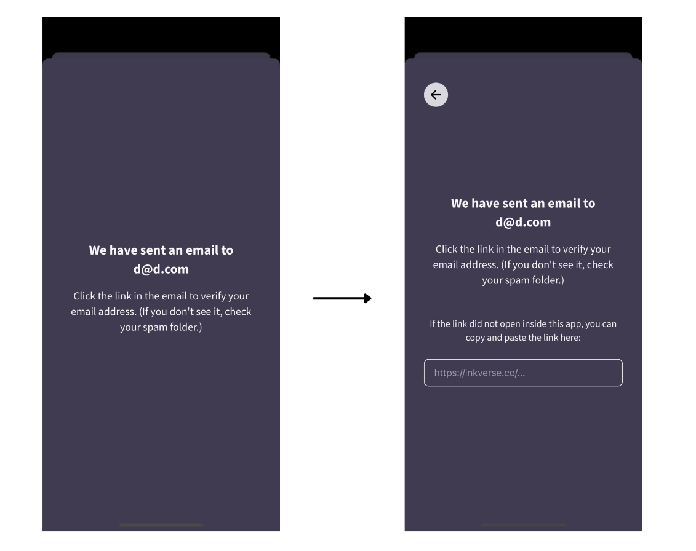

# 🚀 Inkverse Setup Instructions

**Inkverse** is a fun comic reading app built using Typescript, React, React Native, Node.js, and GraphQL.

## 📋 Table of Contents

- [Monorepo Structure](#-monorepo-structure)
- [Architecture](#-architecture)
- [Quick Setup (Website)](#-quick-setup-website)
- [Quick Setup (React Native)](#-quick-setup-react-native)
- [Full Local Setup](#-full-local-setup)
- [Helpful Commands](#-helpful-commands)
- [Additional Docs](#-additional-docs)

## 🏗️ Monorepo Structure

```
website/          # React web frontend
react-native/     # React Native mobile app
graphql-server/   # Node.js GraphQL backend
worker/           # To run background jobs
cloud/            # Cloudflare edge services
packages/         # Internal packages
  ├── shared-client/   # Frontend shared utilities
  ├── shared-server/   # Backend shared utilities
  └── public/         # Shared constants and types
```

## 🏛️ Architecture


---

## ⚡ Quick Setup (Website)

> Setup the website by pointing it to Inkverse's production API for quick setup and without needing to setup a local server.

### Prerequisites

- **Node.js** >= 20
- **Yarn** package manager

### Steps

#### 1. Install Dependencies

```bash
# Install all project dependencies
yarn install
```

#### 2. Configure Custom Localhost

We use `inkverse.test` instead of `localhost` to avoid cookie conflicts between projects. Add to your hosts file (`sudo vim /etc/hosts` on Mac/Linux):

```hosts
127.0.0.1               localhost
127.0.0.1               inkverse.test
```

#### 3. Configure for Production API

In `website/config.ts`, change:

```typescript
// Change this line:
export const config = developmentConfig;

// To this:
export const config = developmentConfigButProductionData;
```

This will get the website to use Inkverse's production API.

#### 4. Build and Watch for changes in internal packages

```bash
# Start watching internal packages
yarn watch:internal-packages
```

#### 5. Start the Website

```bash
cd website
yarn dev
```

🎉 **Success!** Visit [inkverse.test:8082](http://inkverse.test:8082) to see the app.

#### 6. Authentication Note

> ⚠️ **Note**: Google/Apple/Email signup don't work in local development due to CORS restrictions. Use the React Native app for production account login.

---

## 📱 Quick Setup (React Native)

> Setup the iOS/Android apps by pointing it to Inkverse's production API for quick setup and without needing to setup a local server.

### Prerequisites

- **Node.js** >= 20
- **Yarn** package manager

### Steps

#### 1. Install Dependencies

```bash
yarn install
```

#### 2. Configure Custom Localhost

We use `inkverse.test` instead of `localhost` to avoid cookie conflicts between projects. Add to your hosts file (`sudo vim /etc/hosts` on Mac/Linux):

```hosts
127.0.0.1               localhost
127.0.0.1               inkverse.test
```

#### 3. Configure for Production API

In `react-native/config.ts`, change:
```typescript
// Change this line:
export const config = developmentConfig;

// To this:
export const config = developmentConfigButProductionData;
```

This will get the React Native app to use Inkverse's production API.

#### 4. Build and Watch for changes in internal packages

```bash
# Start watching internal packages
yarn watch:internal-packages
```

#### 5. Start the App

```bash
cd react-native
yarn dev
```

- Press `i` for iOS Simulator
- Press `a` for Android Emulator

#### 6. Login with Production Account

> ⚠️ **Note**: Google/Apple signup don't work in local development. Use email login:

1. Go to Profile → Sign Up → Continue with email
2. Check your email for the login link
3. When you return to the app, paste the login link in the text input



---

## 🛠️ Full Local Setup

> **Complete Setup**: For building new features or fixing complex bugs, you'll need to setup the backend as well as the website and mobile apps. Follow the steps below to setup the backend locally.

### Prerequisites

- **Node.js** >= 20
- **Yarn** package manager
- **Docker Desktop** ([Download here](https://store.docker.com/editions/community/docker-ce-desktop-mac))

### Steps

#### 1. Environment Configuration

Copy the environment template:
```bash
cp packages/shared-server/.env.example packages/shared-server/.env
```

#### 2. Database Setup (PostgreSQL)

Create and start PostgreSQL container:
```bash
# Replace USERNAME, PASSWORD, and DB-NAME with your preferred values
docker run --name inkverse-postgres \
  -e POSTGRES_USER=USERNAME \
  -e POSTGRES_PASSWORD=PASSWORD \
  -e POSTGRES_DB=DB-NAME \
  -d \
  -v ~/docker-vms/inkverse-postgresdata:/var/lib/postgresql/data \
  -p "5432:5432" \
  postgres:13.16
```

Update `.env` file:
```env
DATABASE_USERNAME=USERNAME
DATABASE_PASSWORD=PASSWORD
DATABASE_NAME=DB-NAME
DATABASE_ENDPOINT=localhost
DATABASE_PORT=5432
```

#### 3. Message Queue Setup (AWS SQS Local)

```bash
docker run -d --name inkverse-queues -p 4102:4100 admiralpiett/goaws
```

#### 4. JWT Key Generation

Generate RSA key pair for JWT tokens:

```bash
# Generate private key
ssh-keygen -t rsa -b 4096 -m PEM -f jwt.key

# Generate public key
openssl rsa -in jwt.key -pubout -outform PEM -out jwt.key.pub
```

Update `.env` file with the keys (remove newlines, replace with `\n`):
```env
PUBLIC_JWT=your_public_key_here
PRIVATE_JWT=your_private_key_here
```

Clean up key files:
```bash
rm jwt.key jwt.key.pub
```

#### 5. Install Dependencies

```bash
yarn install
```

#### 6. Database Migration

```bash
yarn run migrate
```

#### 7. Configure Hosts

Add to your hosts file (`sudo vim /etc/hosts`):
```hosts
127.0.0.1               localhost
127.0.0.1               inkverse.test
127.0.0.1               us-east-1.goaws.com # For AWS SQS Local
```

#### 8. Start Internal Packages

```bash
# Keep this running in a separate terminal
yarn watch:internal-packages
```

#### 9. Start the Backend

```bash
cd graphql-server
yarn run dev
```

🎉 **Success!** Inkverse Server is running on [inkverse.test:3010](http://inkverse.test:3010/).

---

## 💡 Helpful Commands

### 🐳 Docker Management

```bash
# Start all containers
docker start inkverse-postgres && docker start inkverse-queues

# Stop all containers
docker stop inkverse-postgres && docker stop inkverse-queues

# View running containers
docker ps -a
```

### 🔧 Development Commands

```bash
# Watch and rebuild internal packages
yarn watch:internal-packages

# Start backend server
cd graphql-server && yarn run dev

# Start website
cd website && yarn run dev

# Start React Native (Expo)
cd react-native && yarn dev

# Start React Native (Development Build)
cd react-native && yarn run ios     # iOS
cd react-native && yarn run android # Android
```

### 📊 Database Commands

```bash
# Run migrations
yarn run migrate

# Rollback last migration
yarn run migrate:rollback
```

### 🔄 GraphQL Commands

```bash
# Generate types after schema changes
yarn run graphql-codegen
```

---

## 📚 Additional Docs

| Document | Description |
|----------|-------------|
| [CLAUDE.md](./CLAUDE.md) | Claude AI instructions for working with the project |
| [Architecture](./docs/architecture.md) | High-level overview of the application |
| [Docs Folder](./docs) | Complete project documentation |