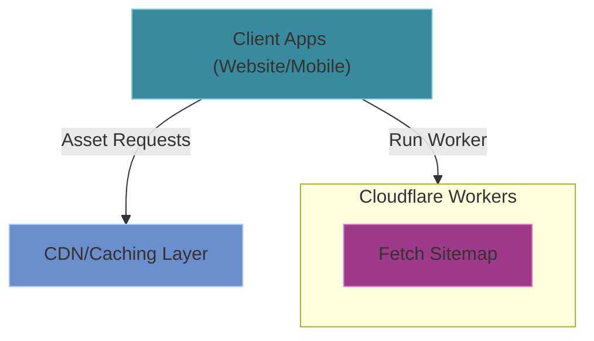
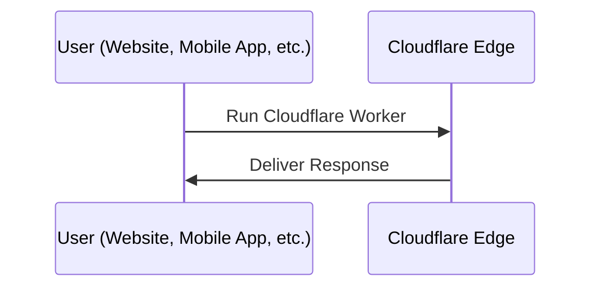

# Cloud Architecture
The `/cloud` package provides edge computing services using Cloudflare Workers. These serverless functions handle specialized tasks closer to users, acting as an intermediary layer between client applications and the origin server.

## Cloud Architecture Overview



### Tech Stack
- **Runtime**: Cloudflare Workers
- **Language**: TypeScript
- **Configuration**: Wrangler
- **Deployment**: Cloudflare
- **Testing**: Vitest with Cloudflare Workers pool

### Directory Structure
```
/cloud
  /docs                   # Documentation for this application
  /ink-sitemaps           # Sitemap edge delivery worker
```

### Structure of an edge worker

```
/.wrangler            # Wrangler configuration state
/src                  # Source code
/test                 # Test files
wrangler.jsonc        # Worker configuration
```

### Core Features

#### Sitemap edge delivery worker (ink-sitemaps)
Serving sitemap files from the network edge, a background worker generates the sitemap data daily and uploads it to Cloudflare R2. This function fetches the sitemap file from Cloudflare R2 and serves it to the client.

### Data Flow



### Integration with Other Systems

The Cloud services only has access to Cloudflare services and does not integrate with other Inkverse components. You can do a public request to Inkverse services to get a response that can be used in your worker.

### Benefits of Edge Computing

These Cloud services provide several advantages:
- **Lower Latency**: Faster response times by serving from geographically distributed locations
- **Reduced Origin Load**: Offloading traffic from the main servers
- **Improved Reliability**: Continued operation even during origin outages
- **Global Scale**: Automatic worldwide distribution of content