# MEMORY BANK BUILD MODE

Your role is to build the planned changes following the implementation plan and creative phase decisions for the target application in the Inkverse monorepo.

```mermaid
graph TD
    Start["🚀 START BUILD MODE"] --> ReadDocs["📚 Read Reference Documents<br>.cursor/rules/isolation_rules/Core/command-execution.mdc"]
    
    %% Target Application Check
    ReadDocs --> TargetApp["🎯 Identify Target<br>Application from targetApp.md"]
    TargetApp --> AppType{"📱 Application<br>Type"}
    
    AppType -->|"Website"| WebsiteType["Website<br>(React)"]
    AppType -->|"Mobile"| MobileType["Mobile App<br>(React Native)"]
    AppType -->|"GraphQL"| GraphQLType["GraphQL Server<br>(Node.js)"]
    AppType -->|"Worker"| WorkerType["Worker<br>(Node.js)"]
    AppType -->|"Cross-App"| CrossAppType["Cross-Application<br>Changes"]
    
    WebsiteType & MobileType & GraphQLType & WorkerType & CrossAppType --> CheckLevel{"🧩 Determine<br>Complexity Level<br>from tasks.md"}
    
    %% Level 1 Implementation
    CheckLevel -->|"Level 1<br>Quick Bug Fix"| L1Process["🔧 LEVEL 1 PROCESS<br>.cursor/rules/isolation_rules/visual-maps/implement-mode-map.mdc"]
    L1Process --> L1Review["🔍 Review Bug<br>Report"]
    L1Review --> L1Examine["👁️ Examine<br>Relevant Code"]
    L1Examine --> L1Fix["⚒️ Implement<br>Targeted Fix"]
    L1Fix --> L1Test["✅ Test<br>Fix"]
    L1Test --> L1Update["📝 Update<br>tasks.md"]
    
    %% Level 2 Implementation
    CheckLevel -->|"Level 2<br>Simple Enhancement"| L2Process["🔨 LEVEL 2 PROCESS<br>.cursor/rules/isolation_rules/visual-maps/implement-mode-map.mdc"]
    L2Process --> L2Review["🔍 Review Build<br>Plan"]
    L2Review --> L2Examine["👁️ Examine Relevant<br>Code Areas"]
    L2Examine --> L2Implement["⚒️ Implement Changes<br>Sequentially"]
    L2Implement --> L2Test["✅ Test<br>Changes"]
    L2Test --> L2Update["📝 Update<br>tasks.md"]
    
    %% Level 3-4 Implementation
    CheckLevel -->|"Level 3-4<br>Feature/System"| L34Process["🏗️ LEVEL 3-4 PROCESS<br>.cursor/rules/isolation_rules/visual-maps/implement-mode-map.mdc"]
    L34Process --> L34Review["🔍 Review Plan &<br>Creative Decisions"]
    L34Review --> L34Phase{"📋 Select<br>Build<br>Phase"}
    
    %% Implementation Phases
    L34Phase --> L34Phase1["⚒️ Phase 1<br>Build"]
    L34Phase1 --> L34Test1["✅ Test<br>Phase 1"]
    L34Test1 --> L34Document1["📝 Document<br>Phase 1"]
    L34Document1 --> L34Next1{"📋 Next<br>Phase?"}
    L34Next1 -->|"Yes"| L34Phase
    
    L34Next1 -->|"No"| L34Integration["🔄 Integration<br>Testing"]
    L34Integration --> L34Document["📝 Document<br>Integration Points"]
    L34Document --> L34Update["📝 Update<br>tasks.md"]
    
    %% Command Execution
    L1Fix & L2Implement & L34Phase1 --> CommandExec["⚙️ COMMAND EXECUTION<br>.cursor/rules/isolation_rules/Core/command-execution.mdc"]
    CommandExec --> DocCommands["📝 Document Commands<br>& Results"]
    
    %% Implementation Documentation
    DocCommands -.-> DocTemplate["📋 BUILD DOC:<br>- Target Application<br>- Code Changes<br>- Commands Executed<br>- Results/Observations<br>- Status"]
    
    %% Completion & Transition
    L1Update & L2Update & L34Update --> VerifyComplete["✅ Verify Build<br>Complete"]
    VerifyComplete --> UpdateTasks["📝 Final Update to<br>tasks.md"]
    UpdateTasks --> Transition["⏭️ NEXT MODE:<br>REFLECT MODE"]
    
    %% Validation Options
    Start -.-> Validation["🔍 VALIDATION OPTIONS:<br>- Identify target application<br>- Review build plans<br>- Show code build<br>- Document command execution<br>- Test builds<br>- Show mode transition"]
    
    %% Styling
    style Start fill:#4da6ff,stroke:#0066cc,color:white
    style ReadDocs fill:#80bfff,stroke:#4da6ff
    style TargetApp fill:#f9d77e,stroke:#d9b95c,color:black
    style AppType fill:#f9d77e,stroke:#d9b95c,color:black
    style WebsiteType fill:#a3dded,stroke:#4db8db
    style MobileType fill:#a3e0ae,stroke:#4dbb5f
    style GraphQLType fill:#e699d9,stroke:#d94dbb
    style WorkerType fill:#ffb366,stroke:#cc7a30
    style CrossAppType fill:#d9e6ff,stroke:#99ccff
    style CheckLevel fill:#d94dbb,stroke:#a3378a,color:white
    style L1Process fill:#4dbb5f,stroke:#36873f,color:white
    style L2Process fill:#ffa64d,stroke:#cc7a30,color:white
    style L34Process fill:#ff5555,stroke:#cc0000,color:white
    style CommandExec fill:#d971ff,stroke:#a33bc2,color:white
    style VerifyComplete fill:#4dbbbb,stroke:#368787,color:white
    style Transition fill:#5fd94d,stroke:#3da336,color:white
```



## BUILD STEPS

### Step 1: READ COMMAND EXECUTION RULES
```
read_file({
  target_file: ".cursor/rules/isolation_rules/Core/command-execution.mdc",
  should_read_entire_file: true
})
```

### Step 2: READ TASKS, TARGET APPLICATION & IMPLEMENTATION PLAN
```
read_file({
  target_file: "tasks.md",
  should_read_entire_file: true
})

read_file({
  target_file: "targetApp.md",
  should_read_entire_file: true
})

read_file({
  target_file: "implementation-plan.md",
  should_read_entire_file: true
})
```

### Step 3: LOAD IMPLEMENTATION MODE MAP
```
read_file({
  target_file: ".cursor/rules/isolation_rules/visual-maps/implement-mode-map.mdc",
  should_read_entire_file: true
})
```

### Step 4: LOAD COMPLEXITY-SPECIFIC IMPLEMENTATION REFERENCES
Based on complexity level determined from tasks.md, load:

#### For Level 1:
```
read_file({
  target_file: ".cursor/rules/isolation_rules/Level1/workflow-level1.mdc",
  should_read_entire_file: true
})
```

#### For Level 2:
```
read_file({
  target_file: ".cursor/rules/isolation_rules/Level2/workflow-level2.mdc",
  should_read_entire_file: true
})
```

#### For Level 3-4:
```
read_file({
  target_file: ".cursor/rules/isolation_rules/Phases/Implementation/implementation-phase-reference.mdc",
  should_read_entire_file: true
})

read_file({
  target_file: ".cursor/rules/isolation_rules/Level4/phased-implementation.mdc",
  should_read_entire_file: true
})
```

## MONOREPO APPLICATION STRUCTURE


## APPLICATION-SPECIFIC COMMANDS


## BUILD APPROACH

Your task is to build the changes defined in the implementation plan, following the decisions made during the creative phases if applicable. First, identify the target application in the monorepo, then execute changes systematically, document results, and verify that all requirements are met.

### Target Application Selection

Begin by identifying which application in the monorepo is the target for implementation:

1. **Website (React)**: Changes to the React web application (located in `/website`)
2. **Mobile App (React Native)**: Changes to the React Native mobile application (located in `/react-native`)
3. **GraphQL Server**: Changes to backend API functionality (located in `/graphql-server`)
4. **Worker**: Changes to background processes, event handling, or messaging (located in `/worker`)
5. **Cross-Application**: Changes affecting multiple applications in the monorepo

All commands and paths should be executed in the context of the target application.

### Level 1: Quick Bug Fix Build

For Level 1 tasks, focus on implementing targeted fixes for specific issues in the identified application. Understand the bug, examine the relevant code, implement a precise fix, and verify that the issue is resolved.

```mermaid
graph TD
    L1["🔧 LEVEL 1 BUILD"] --> App["Confirm target application"]
    App --> Review["Review the issue carefully"]
    Review --> Locate["Locate specific code causing the issue"]
    Locate --> Fix["Implement focused fix"]
    Fix --> Test["Test thoroughly to verify resolution"]
    Test --> Doc["Document the solution"]
    
    style L1 fill:#4dbb5f,stroke:#36873f,color:white
    style App fill:#f9d77e,stroke:#d9b95c
    style Review fill:#d6f5dd,stroke:#a3e0ae
    style Locate fill:#d6f5dd,stroke:#a3e0ae
    style Fix fill:#d6f5dd,stroke:#a3e0ae
    style Test fill:#d6f5dd,stroke:#a3e0ae
    style Doc fill:#d6f5dd,stroke:#a3e0ae
```



### Level 2: Enhancement Build

For Level 2 tasks, implement changes according to the plan created during the planning phase for the specific application. Ensure each step is completed and tested before moving to the next, maintaining clarity and focus throughout the process.

```mermaid
graph TD
    L2["🔨 LEVEL 2 BUILD"] --> App["Confirm target application"]
    App --> Plan["Follow build plan"]
    Plan --> Components["Build each component"]
    Components --> Test["Test each component"]
    Test --> Integration["Verify integration"]
    Integration --> Doc["Document build details"]
    
    style L2 fill:#ffa64d,stroke:#cc7a30,color:white
    style App fill:#f9d77e,stroke:#d9b95c
    style Plan fill:#ffe6cc,stroke:#ffa64d
    style Components fill:#ffe6cc,stroke:#ffa64d
    style Test fill:#ffe6cc,stroke:#ffa64d
    style Integration fill:#ffe6cc,stroke:#ffa64d
    style Doc fill:#ffe6cc,stroke:#ffa64d
```



### Level 3-4: Phased Build

For Level 3-4 tasks, implement using a phased approach as defined in the implementation plan, navigating to the correct application directory. Each phase should be built, tested, and documented before proceeding to the next, with careful attention to integration between components.

```mermaid
graph TD
    L34["🏗️ LEVEL 3-4 BUILD"] --> App["Confirm target application"]
    App --> CreativeReview["Review creative phase decisions"]
    CreativeReview --> Phases["Build in planned phases"]
    Phases --> Phase1["Phase 1: Core components"]
    Phases --> Phase2["Phase 2: Secondary components"]
    Phases --> Phase3["Phase 3: Integration & polish"]
    Phase1 & Phase2 & Phase3 --> Test["Comprehensive testing"]
    Test --> Doc["Detailed documentation"]
    
    style L34 fill:#ff5555,stroke:#cc0000,color:white
    style App fill:#f9d77e,stroke:#d9b95c
    style CreativeReview fill:#ffaaaa,stroke:#ff8080
    style Phases fill:#ffaaaa,stroke:#ff8080
    style Phase1 fill:#ffaaaa,stroke:#ff8080
    style Phase2 fill:#ffaaaa,stroke:#ff8080
    style Phase3 fill:#ffaaaa,stroke:#ff8080
    style Test fill:#ffaaaa,stroke:#ff8080
    style Doc fill:#ffaaaa,stroke:#ff8080
```



## COMMAND EXECUTION PRINCIPLES

When building changes, follow these command execution principles for optimal results:


Focus on effective building while adapting your approach to the platform environment and target application. All commands should be executed in the context of the correct application directory within the monorepo.

## VERIFICATION


Before completing the build phase, verify that the target application is correctly identified, all build steps have been completed, changes have been thoroughly tested, the build meets all requirements, details have been documented, tasks.md has been updated with the current status, and any cross-application impacts have been addressed. Once verified, prepare for the reflection phase.
