# MEMORY BANK PLAN MODE

Your role is to create a detailed plan for task execution based on the complexity level determined in the INITIALIZATION mode, identifying the target application within the Inkverse monorepo.

```mermaid
graph TD
    Start["🚀 START PLANNING"] --> ReadTasks["📚 Read tasks.md<br>.cursor/rules/isolation_rules/main.mdc"]
    
    %% Complexity Level Determination
    ReadTasks --> AppSelect["🎯 Select Target<br>Application"]
    AppSelect --> AppType{"📱 Application<br>Type"}
    
    AppType -->|"Website"| WebsiteType["Website<br>(React)"]
    AppType -->|"Mobile"| MobileType["Mobile App<br>(React Native)"]
    AppType -->|"GraphQL"| GraphQLType["GraphQL Server<br>(Node.js)"]
    AppType -->|"Worker"| WorkerType["Worker<br>(Node.js)"]
    AppType -->|"Cross-App"| CrossAppType["Cross-Application<br>Changes"]
    
    WebsiteType & MobileType & GraphQLType & WorkerType & CrossAppType --> CheckLevel{"🧩 Determine<br>Complexity Level"}
    
    %% Complexity Level Determination
    CheckLevel -->|"Level 2"| Level2["📝 LEVEL 2 PLANNING<br>.cursor/rules/isolation_rules/visual-maps/plan-mode-map.mdc"]
    CheckLevel -->|"Level 3"| Level3["📋 LEVEL 3 PLANNING<br>.cursor/rules/isolation_rules/visual-maps/plan-mode-map.mdc"]
    CheckLevel -->|"Level 4"| Level4["📊 LEVEL 4 PLANNING<br>.cursor/rules/isolation_rules/visual-maps/plan-mode-map.mdc"]
    
    %% Level 2 Planning
    Level2 --> L2Review["🔍 Review Code<br>Structure"]
    L2Review --> L2Document["📄 Document<br>Planned Changes"]
    L2Document --> L2Challenges["⚠️ Identify<br>Challenges"]
    L2Challenges --> L2Checklist["✅ Create Task<br>Checklist"]
    L2Checklist --> L2Update["📝 Update tasks.md<br>with Plan"]
    L2Update --> L2Verify["✓ Verify Plan<br>Completeness"]
    
    %% Level 3 Planning
    Level3 --> L3Review["🔍 Review Codebase<br>Structure"]
    L3Review --> L3Requirements["📋 Document Detailed<br>Requirements"]
    L3Requirements --> L3Components["🧩 Identify Affected<br>Components"]
    L3Components --> L3Plan["📝 Create Comprehensive<br>Implementation Plan"]
    L3Plan --> L3Challenges["⚠️ Document Challenges<br>& Solutions"]
    L3Challenges --> L3Update["📝 Update tasks.md<br>with Plan"]
    L3Update --> L3Flag["🎨 Flag Components<br>Requiring Creative"]
    L3Flag --> L3Verify["✓ Verify Plan<br>Completeness"]
    
    %% Level 4 Planning
    Level4 --> L4Analysis["🔍 Codebase Structure<br>Analysis"]
    L4Analysis --> L4Requirements["📋 Document Comprehensive<br>Requirements"]
    L4Requirements --> L4Diagrams["📊 Create Architectural<br>Diagrams"]
    L4Diagrams --> L4Subsystems["🧩 Identify Affected<br>Subsystems"]
    L4Subsystems --> L4Dependencies["🔄 Document Dependencies<br>& Integration Points"]
    L4Dependencies --> L4Plan["📝 Create Phased<br>Implementation Plan"]
    L4Plan --> L4Update["📝 Update tasks.md<br>with Plan"]
    L4Update --> L4Flag["🎨 Flag Components<br>Requiring Creative"]
    L4Flag --> L4Verify["✓ Verify Plan<br>Completeness"]
    
    %% Verification & Completion
    L2Verify & L3Verify & L4Verify --> CheckCreative{"🎨 Creative<br>Phases<br>Required?"}
    
    %% Mode Transition
    CheckCreative -->|"Yes"| RecCreative["⏭️ NEXT MODE:<br>CREATIVE MODE"]
    CheckCreative -->|"No"| RecImplement["⏭️ NEXT MODE:<br>IMPLEMENT MODE"]
    
    %% Template Selection
    L2Update -.- Template2["TEMPLATE L2:<br>- Overview<br>- Target Application<br>- Files to Modify<br>- Implementation Steps<br>- Potential Challenges"]
    L3Update & L4Update -.- TemplateAdv["TEMPLATE L3-4:<br>- Requirements Analysis<br>- Target Application<br>- Components Affected<br>- Architecture Considerations<br>- Implementation Strategy<br>- Detailed Steps<br>- Dependencies<br>- Challenges & Mitigations<br>- Creative Phase Components"]
    
    %% Validation Options
    Start -.-> Validation["🔍 VALIDATION OPTIONS:<br>- Identify target application<br>- Review complexity level<br>- Create planning templates<br>- Identify creative needs<br>- Generate plan documents<br>- Show mode transition"]

    %% Styling
    style Start fill:#4da6ff,stroke:#0066cc,color:white
    style ReadTasks fill:#80bfff,stroke:#4da6ff
    style AppSelect fill:#f9d77e,stroke:#d9b95c,color:black
    style AppType fill:#f9d77e,stroke:#d9b95c,color:black
    style WebsiteType fill:#a3dded,stroke:#4db8db
    style MobileType fill:#a3e0ae,stroke:#4dbb5f
    style GraphQLType fill:#e699d9,stroke:#d94dbb
    style WorkerType fill:#ffb366,stroke:#cc7a30
    style CrossAppType fill:#d9e6ff,stroke:#99ccff
    style CheckLevel fill:#d94dbb,stroke:#a3378a,color:white
    style Level2 fill:#4dbb5f,stroke:#36873f,color:white
    style Level3 fill:#ffa64d,stroke:#cc7a30,color:white
    style Level4 fill:#ff5555,stroke:#cc0000,color:white
    style CheckCreative fill:#d971ff,stroke:#a33bc2,color:white
    style RecCreative fill:#ffa64d,stroke:#cc7a30
    style RecImplement fill:#4dbb5f,stroke:#36873f
```



## IMPLEMENTATION STEPS

### Step 1: READ MAIN RULE & TASKS
```
read_file({
  target_file: ".cursor/rules/isolation_rules/main.mdc",
  should_read_entire_file: true
})

read_file({
  target_file: "tasks.md",
  should_read_entire_file: true
})
```

### Step 2: LOAD PLAN MODE MAP
```
read_file({
  target_file: ".cursor/rules/isolation_rules/visual-maps/plan-mode-map.mdc",
  should_read_entire_file: true
})
```

### Step 3: LOAD COMPLEXITY-SPECIFIC PLANNING REFERENCES
Based on complexity level determined from tasks.md, load one of:

#### For Level 2:
```
read_file({
  target_file: ".cursor/rules/isolation_rules/Level2/task-tracking-basic.mdc",
  should_read_entire_file: true
})
```

#### For Level 3:
```
read_file({
  target_file: ".cursor/rules/isolation_rules/Level3/task-tracking-intermediate.mdc",
  should_read_entire_file: true
})

read_file({
  target_file: ".cursor/rules/isolation_rules/Level3/planning-comprehensive.mdc",
  should_read_entire_file: true
})
```

#### For Level 4:
```
read_file({
  target_file: ".cursor/rules/isolation_rules/Level4/task-tracking-advanced.mdc",
  should_read_entire_file: true
})

read_file({
  target_file: ".cursor/rules/isolation_rules/Level4/architectural-planning.mdc",
  should_read_entire_file: true
})
```

## PLANNING APPROACH

Create a detailed implementation plan based on the complexity level determined during initialization and the target application in the monorepo. Your approach should provide clear guidance while remaining adaptable to project requirements and technology constraints.

## MONOREPO APPLICATION IDENTIFICATION


### Target Application Selection

Begin by identifying which application in the monorepo is the primary target for the planned changes:

1. **Website**: If changes affect the React web application
2. **Mobile App**: If changes affect the React Native mobile application
3. **GraphQL Server**: If changes affect backend API functionality
4. **Worker**: If changes affect background processes, event handling, or messaging
5. **Cross-Application**: If changes affect multiple applications in the monorepo
6. **Shared Utilities**: If changes would be used by multiple applications, it may make sense to use the client, server or public utilities.

Document the target application clearly in the implementation plan and update `targetApp.md` with this information.

### Level 2: Simple Enhancement Planning

For Level 2 tasks, focus on creating a streamlined plan that identifies the specific changes needed and any potential challenges. Review the codebase structure to understand the areas affected by the enhancement and document a straightforward implementation approach.

```mermaid
graph TD
    L2["📝 LEVEL 2 PLANNING"] --> Target["Identify target application"]
    Target --> Doc["Document plan with these components:"]
    Doc --> OV["📋 Overview of changes"]
    Doc --> FM["📁 Files to modify"]
    Doc --> IS["🔄 Implementation steps"]
    Doc --> PC["⚠️ Potential challenges"]
    Doc --> TS["✅ Testing strategy"]
    
    style L2 fill:#4dbb5f,stroke:#36873f,color:white
    style Target fill:#f9d77e,stroke:#d9b95c
    style Doc fill:#80bfff,stroke:#4da6ff
    style OV fill:#cce6ff,stroke:#80bfff
    style FM fill:#cce6ff,stroke:#80bfff
    style IS fill:#cce6ff,stroke:#80bfff
    style PC fill:#cce6ff,stroke:#80bfff
    style TS fill:#cce6ff,stroke:#80bfff
```



### Level 3-4: Comprehensive Planning

For Level 3-4 tasks, develop a comprehensive plan that addresses architecture, dependencies, and integration points. Identify components requiring creative phases and document detailed requirements. For Level 4 tasks, include architectural diagrams and propose a phased implementation approach.

```mermaid
graph TD
    L34["📊 LEVEL 3-4 PLANNING"] --> Target["Identify target application"]
    Target --> Doc["Document plan with these components:"]
    Doc --> RA["📋 Requirements analysis"]
    Doc --> CA["🧩 Components affected"]
    Doc --> AC["🏗️ Architecture considerations"]
    Doc --> IS["📝 Implementation strategy"]
    Doc --> DS["🔢 Detailed steps"]
    Doc --> DP["🔄 Dependencies"]
    Doc --> CM["⚠️ Challenges & mitigations"]
    Doc --> CP["🎨 Creative phase components"]
    Doc --> CI["🔄 Cross-application impacts"]
    Doc --> SU["🔄 Shared Server Utilities"]
    Doc --> SC["🔄 Shared Client Utilities"]
    Doc --> PU["🔄 Public Utilities"]
    
    style L34 fill:#ffa64d,stroke:#cc7a30,color:white
    style Target fill:#f9d77e,stroke:#d9b95c
    style Doc fill:#80bfff,stroke:#4da6ff
    style RA fill:#ffe6cc,stroke:#ffa64d
    style CA fill:#ffe6cc,stroke:#ffa64d
    style AC fill:#ffe6cc,stroke:#ffa64d
    style IS fill:#ffe6cc,stroke:#ffa64d
    style DS fill:#ffe6cc,stroke:#ffa64d
    style DP fill:#ffe6cc,stroke:#ffa64d
    style CM fill:#ffe6cc,stroke:#ffa64d
    style CP fill:#ffe6cc,stroke:#ffa64d
    style CI fill:#ffe6cc,stroke:#ffa64d
    style SU fill:#ffe6cc,stroke:#ffa64d
    style SC fill:#ffe6cc,stroke:#ffa64d
    style PU fill:#ffe6cc,stroke:#ffa64d
```



## CREATIVE PHASE IDENTIFICATION

```mermaid
graph TD
    CPI["🎨 CREATIVE PHASE IDENTIFICATION"] --> Question{"Does the component require<br>design decisions?"}
    Question -->|"Yes"| Identify["Flag for Creative Phase"]
    Question -->|"No"| Skip["Proceed to Implementation"]
    
    Identify --> Types["Identify Creative Phase Type:"]
    Types --> A["🏗️ Architecture Design"]
    Types --> B["⚙️ Algorithm Design"]
    Types --> C["🎨 UI/UX Design"]
    Types --> D["🔄 Cross-App Integration"]
    Types --> E["🔄 Shared Server Utilities"]
    Types --> F["🔄 Shared Client Utilities"]
    Types --> G["🔄 Public Utilities"]
    
    style CPI fill:#d971ff,stroke:#a33bc2,color:white
    style Question fill:#80bfff,stroke:#4da6ff
    style Identify fill:#ffa64d,stroke:#cc7a30
    style Skip fill:#4dbb5f,stroke:#36873f
    style Types fill:#ffe6cc,stroke:#ffa64d
```



Identify components that require creative problem-solving or significant design decisions. For these components, flag them for the CREATIVE mode. Focus on architectural considerations, algorithm design needs, UI/UX requirements, or cross-application integration challenges that would benefit from structured design exploration.

## VERIFICATION


Before completing the planning phase, verify that the target application is clearly identified, all requirements are addressed in the plan, components requiring creative phases are identified, implementation steps are clearly defined, dependencies and challenges are documented, and cross-application impacts are considered. Update tasks.md and targetApp.md with the complete plan and recommend the appropriate next mode based on whether creative phases are required. 
