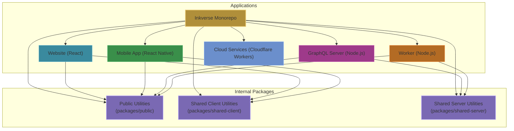
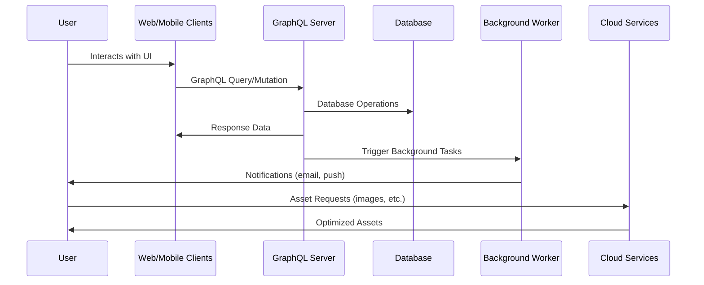

# Inkverse Architecture
Inkverse is a monorepo using yarn workspaces. It includes a React website, a React Native mobile app, a Node.js GraphQL server, a Node.js worker, and 3 internal packages (shared-client, shared-server, public).

## System Overview

## Core Components

### Website (`/website`)
- **Purpose**: Provides the main web interface for users to interact with Inkverse
- **Tech Stack**: React, React Router, Apollo Client, TailwindCSS
- **Key Features**:
  - Comic viewing and navigation
  - Creator tools and interfaces
  - User profiles and personalization
  - List management
  
### Mobile App (`/react-native`)
- **Purpose**: Delivers the Inkverse experience on mobile devices
- **Tech Stack**: React Native, Expo, React Navigation, Apollo Client
- **Key Features**:
  - Native mobile comic reader
  - Offline reading capabilities
  - Push notifications
  - Mobile-optimized creator tools

### GraphQL Server (`/graphql-server`)
- **Purpose**: Centralized API layer that serves data to client applications
- **Tech Stack**: Node.js, Apollo Server, Express
- **Key Features**:
  - Validated GraphQL queries and mutations
  - Database access layer
  - Authentication and authorization
  - Rate limiting and query complexity management

### Worker (`/worker`)
- **Purpose**: Handles background processing and scheduled tasks
- **Tech Stack**: Node.js
- **Key Features**:
  - Email notifications
  - Push notifications
  - Image processing
  - Feed generation
  - Sitemap creation

### Cloud Services (`/cloud`)
- **Purpose**: Edge computing services for performance-critical operations
- **Tech Stack**: Cloudflare Workers, R2, D1
- **Key Features**:
  - Sitemap generation
  - Edge caching
  - Image optimization
  - Geolocation services

## Shared Packages

### Public Utilities (`/packages/public`)
- **Purpose**: Common utilities and types shared across all applications
- **Key Components**:
  - TypeScript interfaces and type definitions
  - Shared constants
  - Common utility functions

### Shared Client (`/packages/shared-client`)
- **Purpose**: Client-side utilities shared between web and mobile
- **Key Components**:
  - GraphQL queries, mutations, and fragments
  - Data fetching patterns via dispatchers
  - Client-side state management utilities

### Shared Server (`/packages/shared-server`)
- **Purpose**: Server-side utilities shared between API and backend services
- **Key Components**:
  - Database schemas and query builders
  - Message queue integration
  - Third-party API clients
  - Caching utilities
  - Email templates and sending logic

## Data Flow

## External Integrations (see `docs/shared-server` for more details)

- **Queue**: AWS SQS
- **GraphQL Edge Caching**: Stellate
- **Storage**: Cloudflare R2
- **Email**: EmailOctopus
- **Analytics**: PostHog
- **Internal Notifications**: Slack

TALK ABOUT SSS