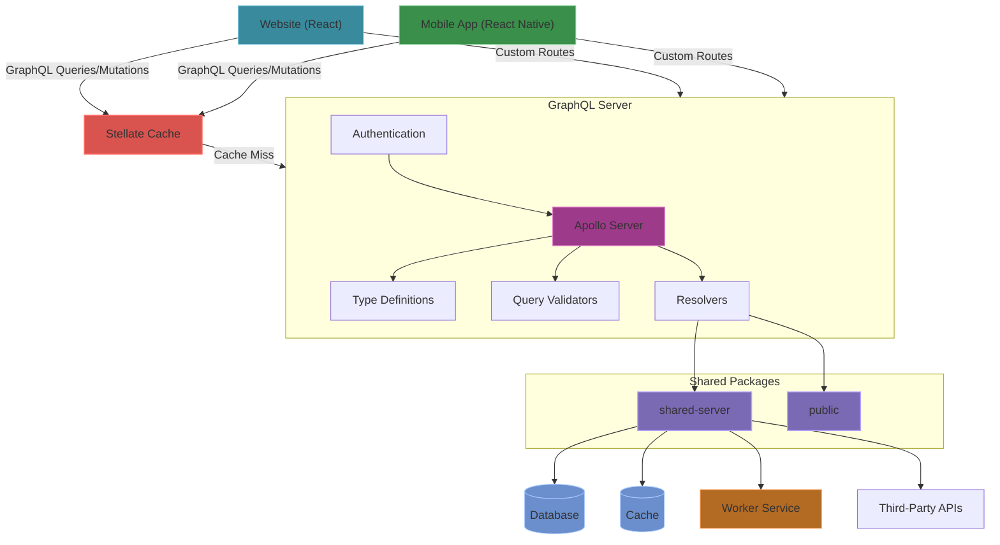
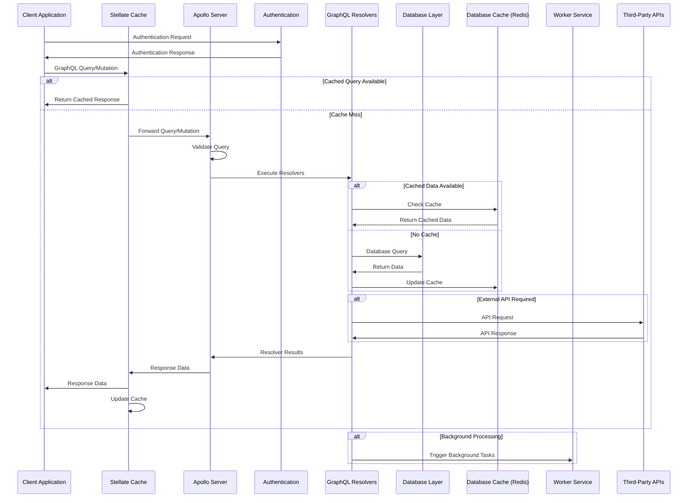

# GraphQL Server Architecture
The GraphQL Server (`/graphql-server`) serves as the centralized API layer for Inkverse, handling all data requests from client applications. It processes all GraphQL queries and mutations, providing a unified interface for data access and manipulation across the platform.

## GraphQL Server Architecture Overview



### Tech Stack
- **Runtime**: Node.js
- **Framework**: Apollo Server, Express
- **Database Access**: Access to the database models (via shared-server package)
- **Authentication**: JSON Web Tokens (JWT)
- **GraphQL Cache**: Stellate cache
- **Database Caching**: Redis (via shared-server package)

### Directory Structure
```
/graphql-server
  /docs                  # Documentation for this application
  /src
    /graphql
      /validators        # Query validation and complexity limits
        required-fields.ts # Validation for required fields
      comicseries.ts     # GraphQL schema and resolvers for comic series
      comicissue.ts      # GraphQL schema and resolvers for comic issues
      comicstory.ts      # GraphQL schema and resolvers for comic stories
      common.ts          # Common GraphQL types and utilities
      creator.ts         # GraphQL schema and resolvers for creators
      creatorcontent.ts  # GraphQL schema and resolvers for creator content
      error.ts           # Error handling and definitions
      home.ts            # GraphQL schema and resolvers for home page
      list.ts            # GraphQL schema and resolvers for lists
      search.ts          # GraphQL schema and resolvers for search
      docs.ts            # Documentation related schemas
      index.ts           # Main GraphQL schema assembly
      utils.ts           # GraphQL utilities
    /notion              # Notion integration for Blog posts
    /routes              # Express routes, including API endpoints
      auth.ts            # Authentication routes
      worker.ts          # Worker-related routes
  /dist                  # Compiled TypeScript code (can be ignored)
```

### Core Features

#### Queries and Mutations
- **Resolvers**: Implementation of all GraphQL queries and mutations
- **Error Handling**: Standardized error responses with proper status codes and messages

#### Query Validation and Security
- **Complexity Analysis**: Prevents resource-intensive queries using a complexity scoring system
- **Rate Limiting**: Enforces query rate limits for API stability
- **Input Sanitization**: Input validation for all queries and mutations

#### Authentication
- **JWT-based Authentication**: Secure user authentication with JSON Web Tokens

#### Integration Points
- **Database Access**: Has access to the database models (via shared-server)
- **Worker Tasks**: Triggers background processing tasks on the Worker service
- **Notion Integration**: CMS via Notion API

### Data Flow

