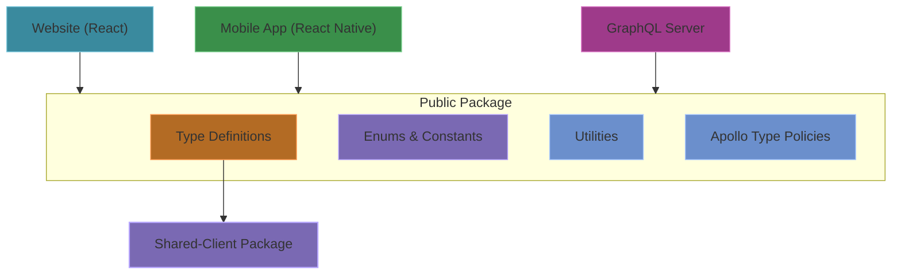
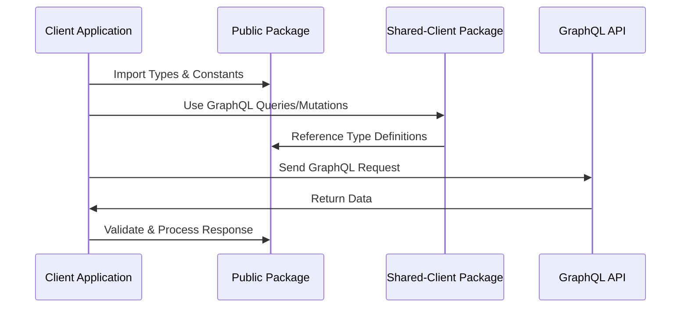

# Public Package Architecture
The Public package (`/packages/public`) is an internal package that serves as a shared set of TypeScript types, constants, and utilities for GraphQL operations used across frontend and backend applications. It provides a helpful and consistent interface for working with the API's data structures.

## Public Package Architecture Overview



### Tech Stack
- **Language**: TypeScript
- **GraphQL**: Apollo Client type definitions
- **Code Generation**: GraphQL Code Generator to generate GraphQL types from the schema

### Directory Structure
```
/packages/public
  /docs             # Documentation for this application
  /src
    /graphql        # GraphQL related utilities and types
      codegen.ts    # Configuration for GraphQL code generation
      types.ts      # Generated TypeScript types from GraphQL schema
    apollo.ts       # Apollo Client type policies configuration
    comicissue.ts   # Comic issue type definitions and utilities
    comicseries.ts  # Comic series type definitions and utilities
    comicstory.ts   # Comic story type definitions and utilities
    country.ts      # Country enum and utilities
    creator.ts      # Creator type definitions and utilities
    genres.ts       # Comic genre definitions
    language.ts     # Language enum and utilities
    layout.ts       # Layout type definitions 
    links.ts        # Link type definitions
    news-items.ts   # News item type definitions
    notion.ts       # Notion API integration utilities
    ratings.ts      # Content rating definitions
    recommendations.ts # Recommendation system type definitions
    report.ts       # Reporting functionality type definitions
    roles.ts        # Content role definitions and utilities
    series-type.ts  # Comic series type enums
    status.ts       # Status enum and utilities
    utils.ts        # Shared utility functions
  /dist            # Compiled TypeScript code (can be ignored)
```

### Core Features

#### GraphQL Type Definitions
- **Generated Types**: Comprehensive type definitions automatically generated from the GraphQL schema
- **Type Safety**: Full TypeScript interfaces for all GraphQL operations

#### Enums & Constants
- **Standardized Enums**: Shared enumerations for countries, languages, content ratings, etc.
- **Consistent Constants**: Centralized definitions of common constants used across the application

#### Apollo Client Configuration
- **Type Policies**: Normalized cache configuration for Apollo Client
- **Default Options**: Standard fetch policy settings

#### Utilities
- **Helper Functions**: Common utility functions for working with the API's data structures

### Data Flow



### Usage Examples

#### Type Definitions
The package provides TypeScript definitions for GraphQL entities:

```typescript
import type { ComicSeries, Creator, Genre } from "packages/public";

// Type-safe comic series object
const series: ComicSeries = {
  uuid: "1234",
  name: "Example Comic",
  // ...other properties
};
```

#### Constants and Enums
Standardized enums for consistent data reference:

```typescript
import { Genre, ContentRating, Language } from "packages/public";

// Type-safe enum values
const primaryGenre = Genre.COMICSERIES_ACTION;
const rating = ContentRating.COMICSERIES_TEENS;
const lang = Language.ENGLISH;
```

#### Apollo Configuration
Apollo Client cache configuration:

```typescript
import { typePolicies, defaultOptions } from "packages/public";

// Configure Apollo Client
const apolloClient = new ApolloClient({
  cache: new InMemoryCache({ typePolicies }),
  defaultOptions
});
``` 