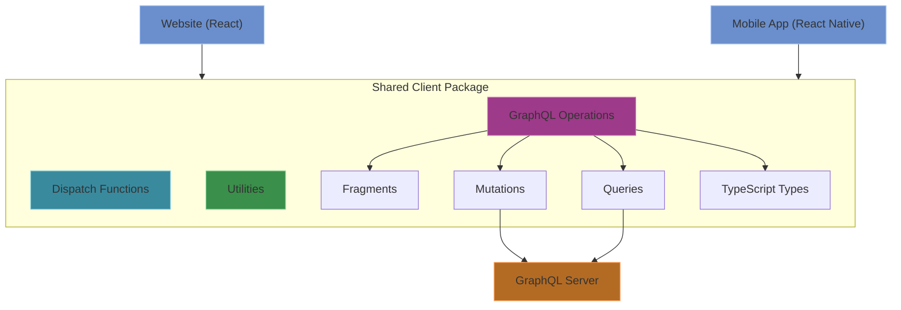
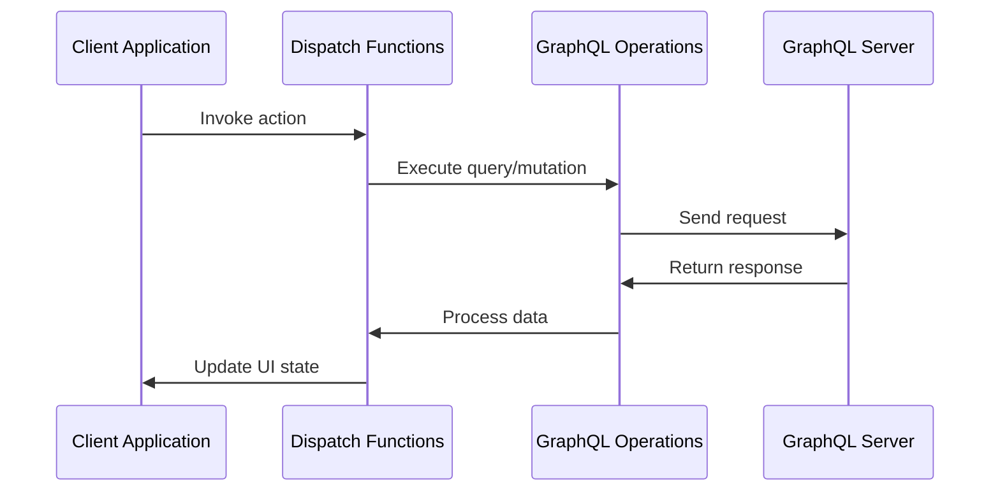

# Shared Client Architecture
The Shared Client package (`/packages/shared-client`) is an internal package that provides common functionality shared between client applications, including the website and mobile app. It centralizes GraphQL operations, dispatch functions, and utility methods to ensure consistency across different client platforms.

## Shared Client Architecture Overview



### Tech Stack
- **Language**: TypeScript
- **GraphQL Client**: Apollo Client (integration with client applications)
- **Code Generation**: GraphQL Code Generator for type-safe operations

### Directory Structure
```
/packages/shared-client
  /docs            # Documentation for this application
  /src
    /graphql
      /fragments     # Reusable GraphQL fragments
      /queries       # GraphQL query operations
      /mutations     # GraphQL mutation operations
      codegen.ts     # GraphQL code generation configuration
      operations.ts  # Generated GraphQL operations
      types.ts       # Generated TypeScript types
    /dispatch        # Client-side data management and operations
      comicissue.ts
      comicseries.ts
      comicslist.ts
      creator.ts
      homefeed.ts
      list.ts
      reports.ts
      search.ts
      utils.ts       # Dispatch-specific utilities
    /utils
      # Shared utility functions
      date.ts
      link-icons.ts
  /dist            # Compiled TypeScript code (can be ignored)
```

### Core Features

#### GraphQL Operations
- **Fragments**: Reusable GraphQL fragments for common data structures
- **Queries**: Shared GraphQL queries for data fetching
- **Mutations**: Shared GraphQL mutations for data modification
- **Type Definitions**: Auto-generated TypeScript types from GraphQL schema

#### Dispatch Functions
- **Data Management**: Functions for managing client-side data
- **API Integration**: Standardized methods for interacting with the GraphQL server
- **State Handling**: Common logic for handling application state changes

#### Utilities
 - **Link Icons**: Shared link icon utilities for consistent UI elements

### Data Flow



### Integration with Client Applications

The shared-client package is imported by client applications (website and mobile) to leverage common functionality:

- **Type Safety**: Provides consistent TypeScript types across platforms
- **Code Reuse**: Prevents duplication of GraphQL operations and business logic
- **Maintainability**: Centralizes changes to data structures and operations 