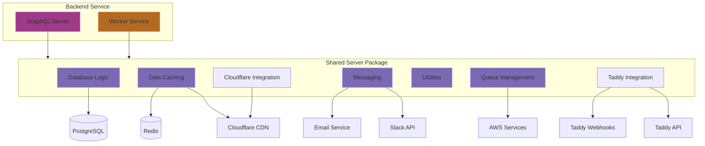
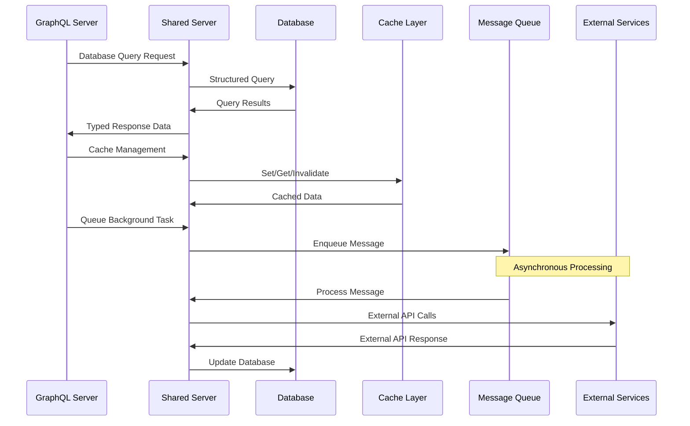

# Shared Server Architecture
The Shared Server package (`/packages/shared-server`) is an internal package that serves as the foundation layer for all server-side functionality in Inkverse. It provides a set of common utilities, database access, caching mechanisms, and integration points that are shared between all backend services, including the GraphQL server and worker services.

## Shared Server Architecture Overview



### Tech Stack
- **Runtime**: Node.js
- **Database**: PostgreSQL with Knex.js
- **Caching**: Redis (for data caching), Stellate (for GraphQL caching)
- **Messaging**: Slack API (for internal notifications), AWS SES (for email)
- **Queue Management**: AWS SQS
- **Storage**: Cloudflare R2
- **Type Safety**: TypeScript

### Directory Structure
```
/packages/shared-server
  /docs            # Documentation for this application
  /src
    /cache         # Caching mechanisms including CDN purging
    /cloudflare    # Cloudflare-specific integrations
    /database      # Database connections and migrations
      /migrations  # Knex.js database migrations
    /models        # Data models and business logic
    /graphql       # GraphQL schema definitions and resolvers
    /messaging     # Email and notification services
      /email       # Email templating and sending
      slack.ts     # Slack integration
    /queues        # Message queue integration with AWS SQS
    /taddy         # Taddy service integration
    /utils         # Shared utility functions
  /dist            # Compiled TypeScript code (can be ignored)
```

### Core Components

#### Data Models
- **Entity Models**: Object-relational mappings for database entities
- **Business Logic**: Common operations and validation for each entity type
- **UUID Management**: Global unique identifier handling across entities

#### Database Access
- **Knex Integration**: Query builder for PostgreSQL
- **Migrations**: Schema management and version control
- **Type Definitions**: TypeScript interfaces for database entities

#### Caching Layer
- **Redis Client**: Fast in-memory caching
- **CDN Cache Management**: Purging and invalidation of cached content
- **Cache Keys**: Standardized cache key generation

#### Messaging
- **Email**: Templated email sending via AWS SES
- **Notifications**: Slack integration for system alerts and monitoring

#### Queue Management
- **SQS Integration**: AWS SQS client for reliable message queuing
- **Queue Processing**: Background job processing infrastructure
- **Message Handling**: Standardized message processing patterns

#### Cloudflare Integration
- **R2 Storage**: Object storage integration
- **CDN Management**: Edge caching and distribution control

#### Taddy Integration
- **Taddy Webhooks**: Webhook integration for event from new or updated comic series, comic issue, or creator
- **Taddy API**: API integration for Taddy services (for easy search)

### Integration Flow

