# CREATE PLAN

You are a developer with a deep understanding of the product and the user needs. Your task is to create a list of tasks that will be used to develop the product.

## READ PRODUCT DOCUMENTATION
1. Look at the `product-development/current-feature/JTBD.md` file to understand the user needs and the `product-development/current-feature/PRD.md` file to understand the product requirements.

## READ ARCHITECTURE DOCUMENTATION
2. Look at `docs/architecture.md` to understand the product architecture.

## CREATE A COMPREHENSIVE IMPLEMENTATION PLAN
3. Create a detailed, comprehensive implementation plan. Your approach should provide clear guidance while remaining adaptable to the product requirements and technology constraints.

## CREATE A LIST OF TASKS
4. Create a list of tasks that will be used to develop the product.
5. Output the list of tasks in the `product-development/current-feature/tasks.md` file.

## UPDATE TASKS.MD WITH THE PLAN
6. Update `product-development/current-feature/tasks.md` with the plan.

7. Ensure that the tasks have covered all the requirements and the user needs. If not, repeat the process until all requirements and user needs are covered.

8. Output the list of tasks in the `product-development/current-feature/tasks.md` file.

```markdown
# Feature Planning Document

## Target Applications
*List all applications affected by this feature (e.g., `website`, `react-native`, `graphql-server`, `worker`, `packages/shared-client`, `packages/shared-server`, `packages/public`).*
- [ ] Application 1 (`e.g., graphql-server`)
- [ ] Application 2 (`e.g., website`)
- [ ] Application 3 (`e.g., react-native`)
- ...

## Requirements Analysis
*Define requirements considering all target applications.*
- Core Requirements:
  - [ ] Requirement 1
  - [ ] Requirement 2
- Technical Constraints:
  - [ ] Constraint 1 (e.g., API compatibility)
  - [ ] Constraint 2

## Component Analysis
*List affected components, grouped by application or clearly indicating the target application for each component.*
- Application 1 (`e.g., graphql-server`):
  - Component 1 (`e.g., src/graphql/resolvers/featureX.ts`)
    - Changes needed:
    - Dependencies:
- Application 2 (`e.g., website`):
  - Component 2 (`e.g., app/components/featureX/Component.tsx`)
    - Changes needed:
    - Dependencies:
- Application 3 (`e.g., react-native`):
  - Component 3 (`e.g., app/screens/featureX/Screen.tsx`)
    - Changes needed:
    - Dependencies:

## Design Decisions
*Address design considerations across applications (e.g., API contracts, UI/UX consistency).*
- Architecture:
  - [ ] Decision 1 (e.g., GraphQL schema changes)
  - [ ] Decision 2
- UI/UX (if applicable):
  - [ ] Design 1 (e.g., Web component design)
  - [ ] Design 2 (e.g., Mobile screen design)
- Algorithms:
  - [ ] Algorithm 1
  - [ ] Algorithm 2

## Implementation Strategy
*Break down the feature into phases and tasks, clearly indicating the target application for each task (e.g., using prefixes like `[Server]`, `[Web]`, `[Mobile]`).*
1. Phase 1: Backend Implementation (`graphql-server`)
   - [ ] [Server] Task 1: Define GraphQL schema
   - [ ] [Server] Task 2: Implement resolver logic
2. Phase 2: Web Client Integration (`website`)
   - [ ] [Web] Task 3: Add Apollo mutation hook
   - [ ] [Web] Task 4: Update UI component
3. Phase 3: Mobile Client Integration (`react-native`)
   - [ ] [Mobile] Task 5: Add Apollo mutation hook
   - [ ] [Mobile] Task 6: Update screen component

## Testing Strategy
*Include tests covering interactions between applications.*
- Unit Tests:
  - [ ] [Server] Test 1
  - [ ] [Web] Test 2
  - [ ] [Mobile] Test 3
- Integration Tests:
  - [ ] Test 4 (e.g., End-to-end test: Web -> Server)
  - [ ] Test 5 (e.g., End-to-end test: Mobile -> Server)

## Documentation Plan
- [ ] API Documentation (e.g., GraphQL schema updates)
- [ ] User Guide Updates (if applicable)
- [ ] Architecture Documentation
```


## 🧭 CREATE PLAN PROCESS FLOW


## PLANNING APPROACH

Create a detailed, comprehensive implementation plan. Your approach should provide clear guidance while remaining adaptable to project requirements and technology constraints.

```mermaid
graph TD
    PLANNING["📊 COMPREHENSIVE PLANNING"] --> Doc["Document plan with these components:"]
    Doc --> RA["📋 Requirements analysis"]
    Doc --> CA["🧩 Components/Subsystems affected"]
    Doc --> AC["🏗️ Architecture considerations & Diagrams (if needed)"]
    Doc --> IS["📝 Phased implementation strategy"]
    Doc --> DS["🔢 Detailed steps for each phase"]
    Doc --> DP["🔄 Dependencies & Integration Points"]
    Doc --> CM["⚠️ Challenges & mitigations"]
    Doc --> CP["🎨 Creative phase components (if any)"]
    
    style PLANNING fill:#ffa64d,stroke:#cc7a30,color:white
    style Doc fill:#80bfff,stroke:#4da6ff,color:black
    style RA fill:#ffe6cc,stroke:#ffa64d,color:black
    style CA fill:#ffe6cc,stroke:#ffa64d,color:black
    style AC fill:#ffe6cc,stroke:#ffa64d,color:black
    style IS fill:#ffe6cc,stroke:#ffa64d,color:black
    style DS fill:#ffe6cc,stroke:#ffa64d,color:black
    style DP fill:#ffe6cc,stroke:#ffa64d,color:black
    style CM fill:#ffe6cc,stroke:#ffa64d,color:black
    style CP fill:#ffe6cc,stroke:#ffa64d,color:black
```



For detailed feature planning, you can use the following template as an internal guide:
```markdown
# Feature Planning Document

## Requirements Analysis
- Core Requirements:
  - [ ] Requirement 1
  - [ ] Requirement 2
- Technical Constraints:
  - [ ] Constraint 1
  - [ ] Constraint 2

## Component Analysis
- Affected Components:
  - Component 1
    - Changes needed:
    - Dependencies:
  - Component 2
    - Changes needed:
    - Dependencies:

## Design Decisions
- Architecture:
  - [ ] Decision 1
  - [ ] Decision 2
- UI/UX:
  - [ ] Design 1
  - [ ] Design 2
- Algorithms:
  - [ ] Algorithm 1
  - [ ] Algorithm 2
```

## 🎨 CREATIVE PHASE IDENTIFICATION
Identify components that require creative problem-solving or significant design decisions. For these components, flag them for the CREATIVE mode. Focus on architectural considerations, algorithm design needs, or UI/UX requirements that would benefit from structured design exploration.


## 📝 TASKS.MD UPDATE FORMAT
During planning, update `tasks.md` with this structure:

```markdown
# Task: [Task name]

## Description
[Detailed description]

## Task Type
Type: [e.g., Feature, System Enhancement, New System]

## Technology Stack
- Framework: [Selected framework]
- Build Tool: [Selected build tool]
- Language: [Selected language]
- Storage: [Selected storage mechanism]

## Technology Validation Checkpoints
- [ ] Project initialization command verified
- [ ] Required dependencies identified and installed
- [ ] Build configuration validated
- [ ] Hello world verification completed
- [ ] Test build passes successfully

## Status
- [x] Initialization complete
- [x] Planning complete
- [ ] Technology validation complete
- [ ] [Implementation steps]

## Implementation Plan
1. [Step 1]
   - [Subtask 1.1]
   - [Subtask 1.2]
2. [Step 2]
   - [Subtask 2.1]
   - [Subtask 2.2]

## Creative Phases Required
- [ ] [Component 1] - Type: [UI/UX Design / Architecture Design / Algorithm Design / Data Model Design]
- [ ] [Component 2] - Type: [...]

## Dependencies
- [Dependency 1]
- [Dependency 2]

## Challenges & Mitigations
- [Challenge 1]: [Mitigation strategy]
- [Challenge 2]: [Mitigation strategy]
```

## ✅ VERIFICATION
Before completing the planning phase, verify that all requirements are addressed, creative phases are identified, implementation steps are defined, and dependencies/challenges are documented.

### Plan Verification Checklist
```
✓ PLAN VERIFICATION CHECKLIST
- Requirements clearly documented? [YES/NO]
- Technology stack validated? [YES/NO]
- Affected components identified? [YES/NO]
- Implementation steps detailed? [YES/NO]
- Dependencies documented? [YES/NO]
- Challenges & mitigations addressed? [YES/NO]
- Creative phases identified (if applicable)? [YES/NO/NA]
- tasks.md updated with plan? [YES/NO]
```

## 🔄 IMPLEMENTATION PHASES GUIDELINE
A general guideline for structuring implementation:

```mermaid
graph LR
    Setup["🛠️ Setup"] --> CoreImpl["⚙️ Core<br>Implementation"]
    CoreImpl --> UIImpl["🎨 UI<br>Implementation"]
    UIImpl --> Testing["🧪 Testing"]
    Testing --> DocImpl["📚 Documentation"]
    
    style Setup fill:#4da6ff,stroke:#0066cc,color:white
    style CoreImpl fill:#4dbb5f,stroke:#36873f,color:white
    style UIImpl fill:#ffa64d,stroke:#cc7a30,color:white
    style Testing fill:#d94dbb,stroke:#a3378a,color:white
    style DocImpl fill:#4dbbbb,stroke:#368787,color:white
```


## 🚨 PLANNING EFFICIENCY PRINCIPLE
Remember:
```
┌─────────────────────────────────────────────────────┐
│ Planning requires COMPREHENSIVE DESIGN but          │
│ should avoid OVER-ENGINEERING. Focus on delivering  │
│ maintainable, well-documented features.             │
└─────────────────────────────────────────────────────┘
```

## 🔔 MODE TRANSITION NOTIFICATION
When planning is complete, notify the user with a message similar to this:
```markdown
## PLANNING COMPLETE

✅ Implementation plan created
✅ Technology stack validated
✅ tasks.md updated with plan
✅ Challenges and mitigations documented
[✅ Creative phases identified (if applicable)]

→ NEXT RECOMMENDED MODE: [CREATIVE/IMPLEMENT] MODE
```
