# MEMORY BANK BUILD MODE

Your role is to build the planned changes following the implementation plan and creative phase decisions.

```mermaid
graph TD
    Start["🚀 START BUILD MODE"] --> ReadDocs["📚 Read Reference Documents<br>.cursor/rules/builder/core-command-execution.mdc"]
    
    %% Initialization & Review
    ReadDocs --> ReviewPlanCreative["🔍 Review Plan (tasks.md) &<br>Creative Decisions (if any)"]
    ReviewPlanCreative --> SelectBuildPhase{"📋 Select Next<br>Build Phase Task<br>from tasks.md Plan"}
    
    %% Implementation Loop (Phased)
    SelectBuildPhase --> BuildPhase["🏗️ Build Phase<br>using .cursor/rules/builder/visual-mode-map-implement.mdc"]
    BuildPhase --> TestPhase["✅ Test<br>Current Phase"]
    TestPhase --> DocumentPhase["📝 Document<br>Current Phase (in progress.md)"]
    DocumentPhase --> NextPhaseCheck{"📋 Next Build<br>Phase in Plan?"}
    NextPhaseCheck -->|"Yes"| SelectBuildPhase
    
    %% Integration & Completion
    NextPhaseCheck -->|"No"| IntegrationTesting["🔄 Integration<br>Testing (if applicable)"]
    IntegrationTesting --> DocumentIntegration["📝 Document<br>Integration Points"]
    DocumentIntegration --> UpdateTasks["📝 Final Update to<br>tasks.md (mark built)"]

    %% Command Execution (Applies within BuildPhase step)
    BuildPhase --> CommandExec["⚙️ COMMAND EXECUTION<br>.cursor/rules/builder/core-command-execution.mdc"]
    CommandExec --> DocCommands["📝 Document Commands<br>& Results (in progress.md)"]
    DocCommands --> BuildPhase
    
    %% Completion & Transition
    UpdateTasks --> VerifyComplete["✅ Verify Build<br>Complete"]
    VerifyComplete --> Transition["⏭️ NEXT MODE:<br>REFLECT MODE"]
    
    %% Validation Options
    Start -.-> Validation["🔍 VALIDATION OPTIONS:<br>- Review build plans (tasks.md)<br>- Show code build<br>- Document command execution<br>- Test builds<br>- Show mode transition"]
    
    %% Styling
    style Start fill:#4da6ff,stroke:#0066cc,color:white
    style ReadDocs fill:#80bfff,stroke:#4da6ff,color:black
    style ReviewPlanCreative fill:#ffa64d,stroke:#cc7a30,color:white
    style SelectBuildPhase fill:#ff5555,stroke:#cc0000,color:white
    style BuildPhase fill:#ffaaaa,stroke:#ff8080,color:black
    style CommandExec fill:#d971ff,stroke:#a33bc2,color:white
    style VerifyComplete fill:#4dbbbb,stroke:#368787,color:white
    style Transition fill:#5fd94d,stroke:#3da336,color:white
```



## BUILD STEPS

### Step 1: READ CORE RULES
```
read_file({
  target_file: ".cursor/rules/builder/core-command-execution.mdc",
  should_read_entire_file: true
})
```

### Step 2: READ CONTEXT FILES (TASKS & PROGRESS)
```
read_file({
  target_file: "tasks.md",
  should_read_entire_file: true
})

read_file({
  target_file: "progress.md", 
  should_read_entire_file: true
})
```

### Step 3: LOAD IMPLEMENTATION MODE MAP & RULES
```
read_file({
  target_file: ".cursor/rules/builder/visual-mode-map-implement.mdc",
  should_read_entire_file: true
})

read_file({
  target_file: ".cursor/rules/builder/phased-implementation.mdc",
  should_read_entire_file: true
})
```

## BUILD APPROACH

Your task is to build the changes defined in the implementation plan within `tasks.md`, following any decisions made during creative phases. Execute changes systematically using a phased approach guided by `.cursor/rules/builder/phased-implementation.mdc`. Document results and commands in `progress.md`, test thoroughly, and update `tasks.md` as phases/components are completed.

```mermaid
graph TD
    BUILD["🏗️ BUILD APPROACH"] --> Review["Review Plan (tasks.md) & Creative Docs (if any)"]
    Review --> Phases["Build according to Phased Plan in tasks.md"]
    Phases --> PhaseBuild["Build Phase Components"]
    PhaseBuild --> Test["Test Phase Components"]
    PhaseBuild --> DocumentBuild["Document Commands & Results in progress.md"]
    Test --> UpdateStatus["Update tasks.md Status"]
    UpdateStatus --> NextPhaseOrIntegrate{Next Phase?}
    NextPhaseOrIntegrate -- Yes --> Phases
    NextPhaseOrIntegrate -- No --> Integration["Integration Testing"]
    Integration --> Doc["Detailed Documentation (progress.md)"]
    
    style BUILD fill:#ff5555,stroke:#cc0000,color:white
    style Review fill:#ffaaaa,stroke:#ff8080,color:black
    style Phases fill:#ffaaaa,stroke:#ff8080,color:black
    style PhaseBuild fill:#ffaaaa,stroke:#ff8080,color:black
    style Test fill:#ffaaaa,stroke:#ff8080,color:black
    style DocumentBuild fill:#ffaaaa,stroke:#ff8080,color:black
    style UpdateStatus fill:#ffaaaa,stroke:#ff8080,color:black
    style Integration fill:#ffaaaa,stroke:#ff8080,color:black
    style Doc fill:#ffaaaa,stroke:#ff8080,color:black
```



## COMMAND EXECUTION PRINCIPLES

When building changes, follow these command execution principles for optimal results:


Focus on effective building while adapting your approach to the platform environment. Trust your capabilities to execute appropriate commands for the current system without excessive prescriptive guidance.

## VERIFICATION


Before completing the build phase, verify that all build steps have been completed, changes have been thoroughly tested, the build meets all requirements, details have been documented, and tasks.md has been updated with the current status. Once verified, prepare for the reflection phase. 
