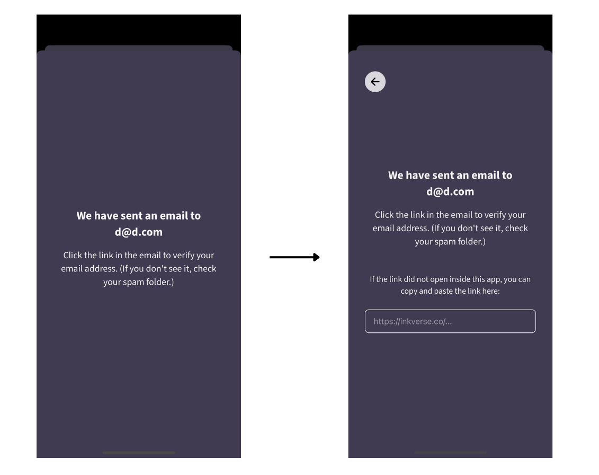

# Inkverse React Native App

This is the main React Native app for Inkverse, a comic reading platform. It creates a native app that can be run on iOS and Android.

## Quick Setup

If you want to quickly setup the iOS or Android apps and see it in action you can setup the app to point to Inkverse's production API. This allows you to tweak code and styles without having to setup your own local server.

### 0. Basic setups
  - Have or Install node >= 20.
  - Install yarn (npm install -g yarn)
  - Download the Inkverse project from GitHub.

### 1. Install packages for the whole Inkverse project

```
yarn install
```

### 2. Localhost vs inkverse.test

We use a custom localhost (inkverse.test) vs localhost, the benefit is that you dont mix up cookies and other brower data between your different localhost projects.

To set it up, add this to your hosts file, by `sudo vim /etc/hosts` on Mac/Linux.

```
127.0.0.1               localhost
127.0.0.1               inkverse.test // Custom localhost for Inkverse
```

This maps both `inkverse.test` and `localhost` to 127.0.0.1, but allows cookies to be isolated for this project. 

### 3. Setup config file

Inside `react-native/config.ts`, change developmentConfig to developmentConfigButProductionData. This will use Inkverse's production API server.

### 4. Build and Watch for changes in shared packages

This will build the shared packages and watch for any changes you make to them.

```
yarn watch:internal-packages
```

### 5. Start the app (React Native)

```
cd react-native
yarn dev
```

You can now select `i` to run the app on the iOS Simulator or `a` to run the app on the Android Emulator.

### 6. To login with your production Inkverse account

Signup with Google or Apple do not work in local development mode for security reasons. However, you can login with email if you want to use your production Inkverse data.

- Go to your Profile and click `Sign Up` and then `Continue with email`. 
- You will get an email with a link to login to your Inkverse account. 
- When you leave the app, and come back to the app, a new text input will appear where you can paste your login link.

- Paste this new link into the text input and you should be logged in and taken to the next screen.

## Full Local Setup

To build new features or fix bugs, you will need to setup your own local server. This includes following the steps in the [root README](../README.md) to setup the database, queues and install dependencies and then following the instructions in [graphql-server/README.md](../graphql-server/README.md) for instructions on how to setup a local server. Once you have setup the local server, continue with the instructions below.

### 1. Reset config file back to developmentConfig.

Inside `config.ts`, if you have updated developmentConfig to developmentConfigButProductionData, make sure to reset it back to developmentConfig. This will use your local server.

### 2. Run the app

```
yarn dev
```

Select `i` to run the app on the iOS Simulator or `a` to run the app on the Android Emulator.

If you get an Apollo error, your local server is not running or your config is not pointing to the correct url.

### Docs

Documentation for this application is in the [docs](./docs) folder. In particular, the [architecture.md](./docs/architecture.md) file contains a high-level overview of the application.