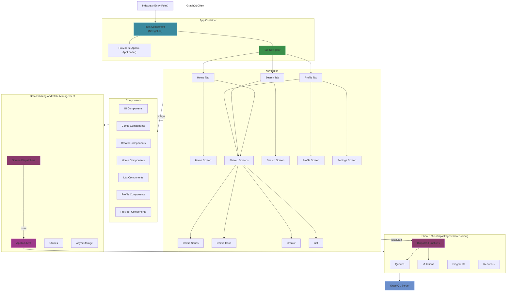
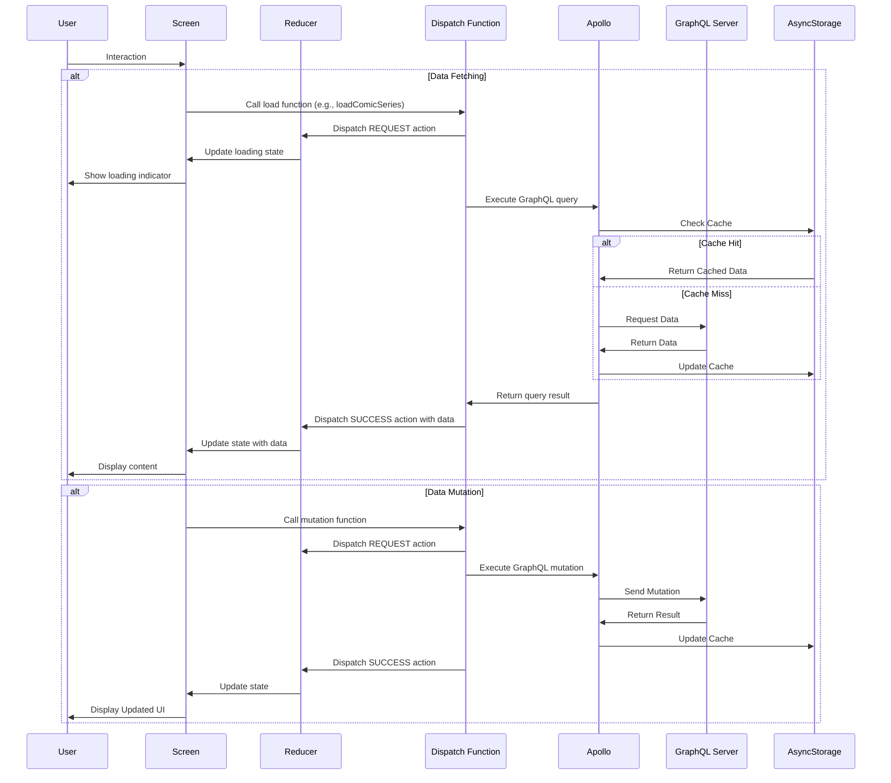

# React Native App Architecture
The React Native app (`/react-native`) serves as the mobile client for Inkverse, available on iOS and Android.

## Architecture Overview



### Tech Stack
- **Framework**: React Native with Expo
- **Language**: TypeScript
- **Navigation**: React Navigation v7
- **State Management**: Dispatch for each screen
- **Data Fetching**: Apollo Client with GraphQL
- **GraphQL Caching**: Apollo Client Cache
- **UI Components**: Custom components with Expo libraries
- **Storage**: AsyncStorage
- **Analytics**: PostHog
- **Error Tracking**: Sentry
- **Deployment**: Expo EAS Build and Updates

### Directory Structure
```
/react-native
  /docs                # Documentation for this application
  /app
    /components        # Reusable components organized by feature
      /comics          # Comic-related components
      /creator         # Creator-related components
      /home            # Home screen components
      /list            # List-related components 
      /profile         # Profile-related components
      /providers       # Provider components (context, etc.)
      /ui              # Shared UI components
    /screens           # Screen components
      /wrapped-screens # HOC-wrapped screen components
  /assets
    /fonts            # Custom fonts
    /icons            # App icons
    /images           # Static images
  /constants          # App constants
  /lib                # Utilities and services
  /credentials        # Platform-specific credentials
  app.json            # Expo configuration
  index.tsx           # App entry point
  config.ts           # Environment configuration
  /.expo              # Expo configuration
```

### Key Features

#### Navigation Architecture
- **Tab Navigation**: Main app navigation with Home, Search, and Profile tabs
- **Stack Navigation**: Each tab has its own navigation stack
- **Deep Linking**: Support for app links through Expo Linking
- **Screen Sharing**: Common screens (Comic Series, Comic Issue, etc.) shared across navigation stacks

#### Data Management
- **Reducer-Based State Management**: Screens use reducer pattern with dispatch functions
- **Dispatch Functions**: Centralized data fetching logic in shared client package
- **Apollo Client**: Two clients (public and user) for public/anonymous and authenticated requests
- **GraphQL Integration**: Connected to the Inkverse GraphQL Server for data fetching/mutations
- **Error Handling**: Centralized error handling with Sentry integration

#### UI/UX Design
- **Component Hierarchy**: Modular components organized by feature
- **Responsive Design**: Adaptive layouts for different screen sizes
- **Platform Specifics**: Platform-specific behavior using Platform API
- **Theme Support**: Light and dark mode support

#### Performance Optimization
- **Hermes Engine**: Optimized JavaScript engine for React Native
- **FlashList**: Efficient list rendering for large datasets
- **Expo Image**: Optimized image loading and caching
- **Apollo Cache**: GraphQL query caching for improved performance

### Data Flow



### Integration Points
- **GraphQL Server**: Primary data source via Apollo Client
- **External Services**: Sentry for error tracking, PostHog for analytics
- **Deep Linking**: Integration with web platform via URL scheme
- **Shared Packages**: Uses shared client code from workspace packages

### Deployment and CI/CD
- **Build System**: Expo EAS Build for native builds
- **OTA Updates**: Expo Updates for over-the-air code updates
- **Distribution**: App Store and Google Play via EAS Submit
- **Environment Config**: Environment-specific configuration via config.ts 