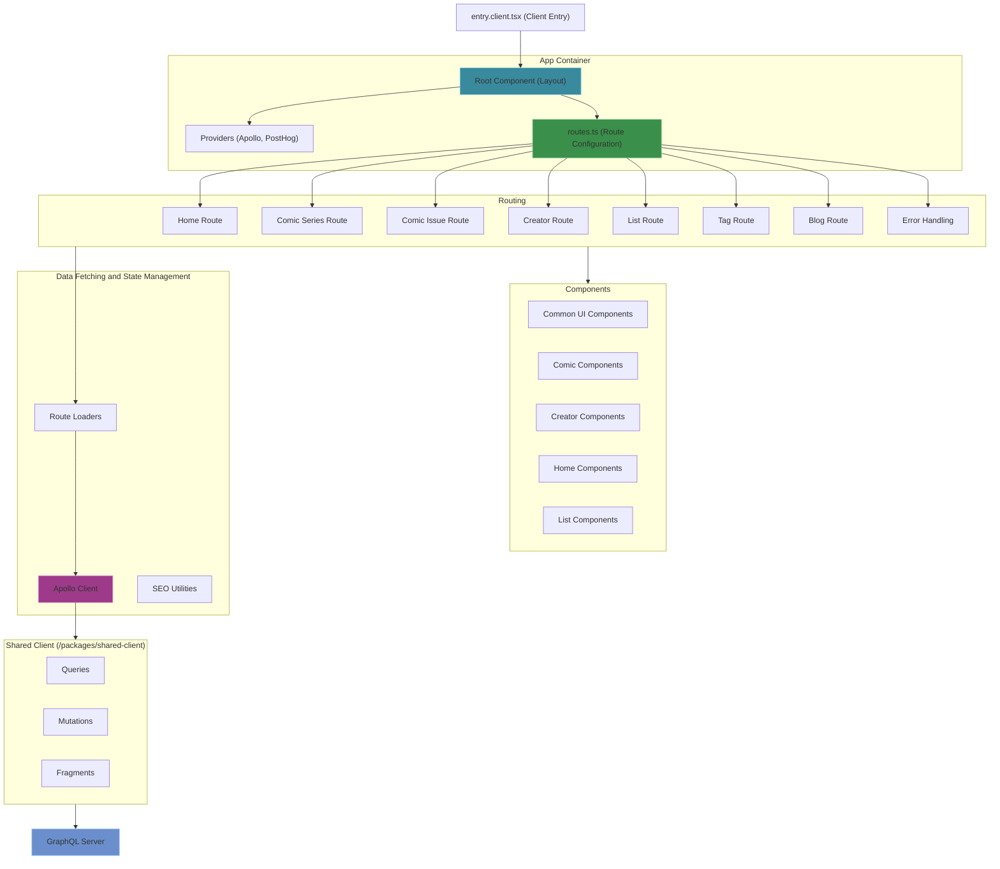
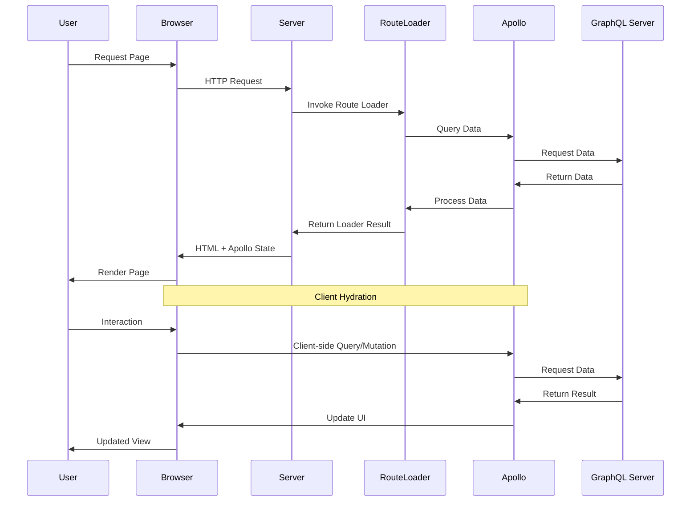

# Website Application Architecture
The Website application (`/website`) serves as the web client for Inkverse.

## Architecture Overview



### Tech Stack
- **Framework**: React Router 7 (with server-side rendering)
- **Language**: TypeScript
- **State Management**: Apollo Client (for GraphQL data)
- **Data Fetching**: Apollo Client with GraphQL
- **UI Components**: Custom components with Tailwind CSS
- **Styling**: Tailwind CSS
- **Analytics**: PostHog
- **Build Tools**: Vite
- **Rendering**: Server-side rendering (SSR) with React Router

### Directory Structure
```
/website
  /docs                 # Documentation for this application
  /app                  # Application source code
    /components         # Reusable components organized by feature
      /comics           # Comic-related components
      /creator          # Creator-related components
      /home             # Home screen components
      /list             # List-related components
      /ui               # Shared UI components
    /routes             # Route components and handlers
    app.css             # Global styles
    entry.client.tsx    # Client-side entry point
    root.tsx            # Root layout component
    routes.ts           # Route definitions
  /assets               # Static assets
    /favicon            # Favicon files
  /lib                  # Utilities and services
    /action             # Action handlers
    /apollo             # Apollo client configuration
    /loader             # Route data loaders
    /meta               # Metadata utilities
    /seo                # SEO utilities
  config.ts             # Environment configuration
  vite.config.ts        # Vite configuration
  react-router.config.ts # React Router configuration
  /.react-router        # Generated React Router files (can be ignored)
```

### Key Features

#### Routing Architecture
- **Declarative Routes**: Routes defined in routes.ts with path patterns
- **Data Loading**: Each route has a corresponding loader for data fetching
- **Error Handling**: Centralized error handling with dedicated error route
- **Meta Tags**: Route-specific meta tag generation for SEO

#### Data Management
- **Reducer-Based State Management**: Screens use reducer pattern with dispatch functions
- **Dispatch Functions**: Centralized data fetching logic in shared client package
- **Apollo Client**: GraphQL client for data fetching/mutations
- **SSR Data Hydration**: Server-rendered data hydrated on client
- **Route Loaders**: Data fetching abstracted in loader functions
- **Error Boundaries**: Graceful error handling within routes

#### UI/UX Design
- **Component Hierarchy**: Modular components organized by feature
- **Responsive Design**: Mobile-first approach with Tailwind CSS
- **Light/Dark Mode**: Theme support with user preference persistence
- **Zoom Controls**: Accessibility features for content scaling

#### Performance Optimization
- **Server-Side Rendering**: Initial HTML rendered on server
- **Apollo Cache**: GraphQL query caching for improved performance
- **Code Splitting**: Route-based code splitting for faster loading
- **Asset Optimization**: Static asset optimization with Vite

### Data Flow



### Integration Points
- **GraphQL Server**: Primary data source via Apollo Client
- **PostHog**: Analytics integration for user behavior tracking
- **Shared Packages**: Utilizes shared client code from workspace packages
- **SEO Optimization**: Meta tag generation for search engine visibility
- **Notion Integration**: Content rendering from Notion for blog posts

### Deployment and CI/CD
- **Build System**: React Router build process for SSR
- **Hosting**: AWS Copilot for container deployment
- **Environment Config**: Environment-specific configuration 
- **Container Deployment**: Docker-based deployment with load balancing
- **Sitemap Generation**: Custom tooling for search engine indexing 