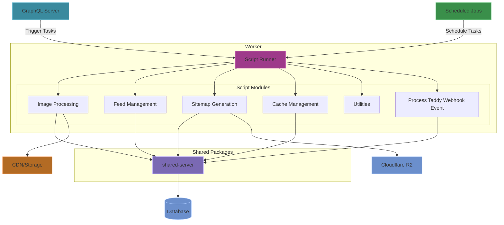
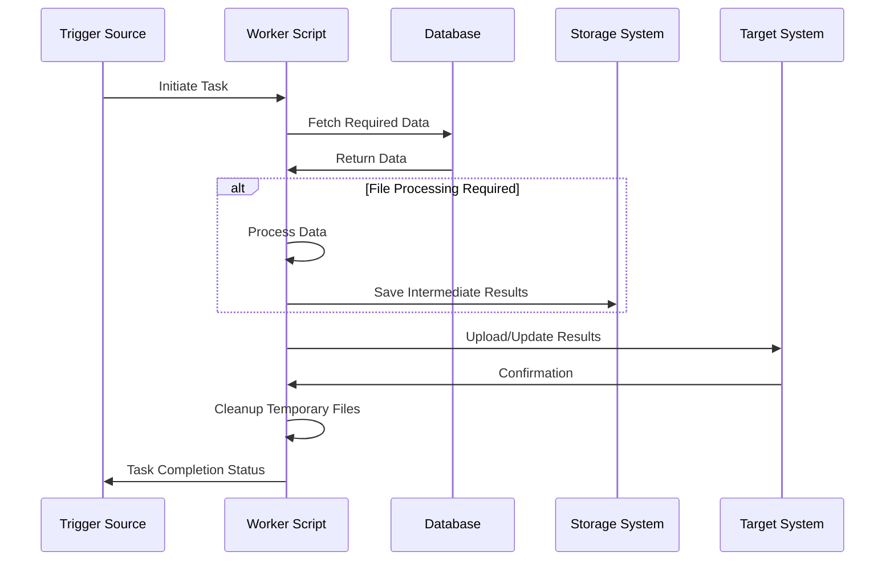

# Worker Architecture
The Worker (`/worker`) serves as the background processing system for Inkverse, handling tasks that are computationally intensive or can be done asynchronously. It performs various maintenance, generation, and data processing tasks that support the platform's operations.

## Worker Architecture Overview



### Tech Stack
- **Runtime**: Node.js
- **Language**: TypeScript
- **Database Access**: PostgreSQL client (via shared-server package)
- **Storage**: File system, Cloudflare R2
- **Task Management**: Script-based execution

### Directory Structure
```
/worker
  /docs               # Documentation for this application
  /input              # Input files for worker tasks
  /output             # Generated output files
  /src
    /scripts          # Task-specific scripts
      /cache          # Cache management tasks
      /feeds          # Feed processing tasks
      /images         # Image processing tasks
      /sitemap        # Sitemap generation tasks
      /utils          # Shared utility functions
  /dist               # Compiled TypeScript code (can be ignored)
```

### Core Features

#### Script-Based Task Execution
- **Standalone Scripts**: Individual task runners for specific functions
- **Input/Output Management**: File-based data handling for task processing
- **Error Handling**: Robust error management and reporting

#### Image Processing
- **Download and Storage**: Fetching and storing images from external sources
- **Optimization**: Image resizing and optimization for performance
- **Asset Management**: Managing comic and creator images

#### Feed Management
- **Comic Import**: Importing comic data from external feeds
- **Feed Auditing**: Validating and ensuring data quality
- **Webhook Simulation**: Testing webhook-based integrations

#### Sitemap Generation
- **SEO Support**: Generating XML sitemaps for search engine optimization
- **Content Mapping**: Creating maps of all available content
- **Split and Upload**: Processing large sitemaps into manageable chunks

#### Cache Management
- **Cache Invalidation**: Clearing cached data when updates occur
- **Performance Optimization**: Maintaining system performance through selective cache management

#### Taddy Webhook Event Processing
- **Taddy Webhook Event**: Processing Taddy webhook events for comic series, comic issue, or creator. Adds or updates the data in the database.


### Data Flow

